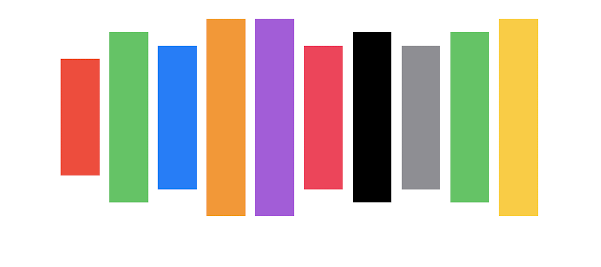

# How to make multicolor pillars using text-length in SwiftUI

Note: This probably has no practical use. This is just for fun.



```Swift
import SwiftUI

struct ContentView: View {
    let colors: [Color] = [.red, .green, .blue, .orange, .purple, .pink, .black, .gray, .green, .yellow]

    var body: some View {
         GeometryReader { geometry in
            ScrollView {
                Spacer(minLength: 20)
                HStack {
                    ForEach(self.colors, id: \.self) { color in
                        Text(color.description.capitalized)
                            .padding()
                            .background(color)
                    }
                }
            }.frame(width: geometry.size.width / 6)
        }
    }
}

struct ContentView_Previews: PreviewProvider {
    static var previews: some View {
        ContentView()
    }
}
```
